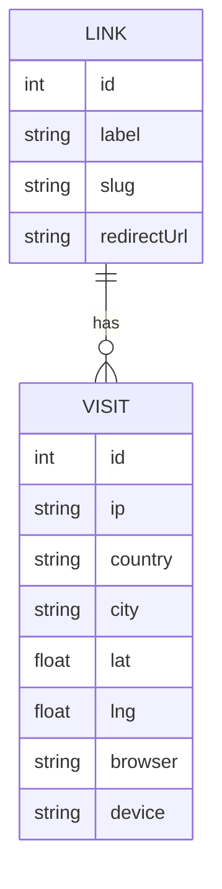

# 🛠️ Implementation & Architecture

This document outlines the technical design, implementation details, and key features of the Anchor Point platform.

## 🏗️ System Architecture

### Frontend Layer
- **Framework**: Next.js 16 (App Router)
- **Styling**: Rem-based Vanilla CSS (`1rem = 16px`) for better accessibility and dynamic scaling.
- **Components**: Functional React components with a focus on modularity (Sidebar, Map, StatsCards).
- **Icons**: Emoji and CSS-based symbols to keep assets minimal and high-performance.

### Backend Layer
- **API Routes**: Standardized RESTful endpoints under `/api/admin/` and a public `/api/track/` endpoint.
- **ORM**: Drizzle ORM providing type-safe interaction with the MySQL database.
- **Authentication**: JWT-based session management using NextAuth.js.

### Data Layer
- **MySQL**: Relational database storing tracking links and detailed visit information.
- **Schema**:
  - `tracking_links`: label, slug, redirectUrl, createdAt.
  - `visits`: ip, location (city/country), browser/device, GPS coordinates.

## ✨ Key Implementations

### 🎯 Visitor Tracking Flow
1.  **Public Access**: Visitor opens `/t/[slug]`.
2.  **Consent**: Browser requests Geolocation permission.
3.  **Capture**: JavaScript collects GPS (if granted) + `navigator.language` + `User-Agent`.
4.  **Submission**: Data is sent to `/api/track`.
5.  **IP-API Integration**: Server resolves the visitor's IP to location data (ISP, Timezone, City, etc.).
6.  **Redirection**: Visitor is redirected to the target `redirectUrl` set for that slug.

### 📱 Responsive Design
- A custom, mobile-first sidebar layout implemented with React state and CSS transforms.
- Automatic overlay and toggle functionality for screens smaller than `48rem` (768px).

### 🛠️ Unit Refactor
- All styling converted from hardcoded `px` to `rem` using 16px base, ensuring consistent scaling regardless of browser font settings.

### 🌐 Development Fixes
- Implemented a local-IP detector to fetch the machine's public IP during development, enabling full location tracking even when testing on `localhost`.

## 📈 Database Relations
